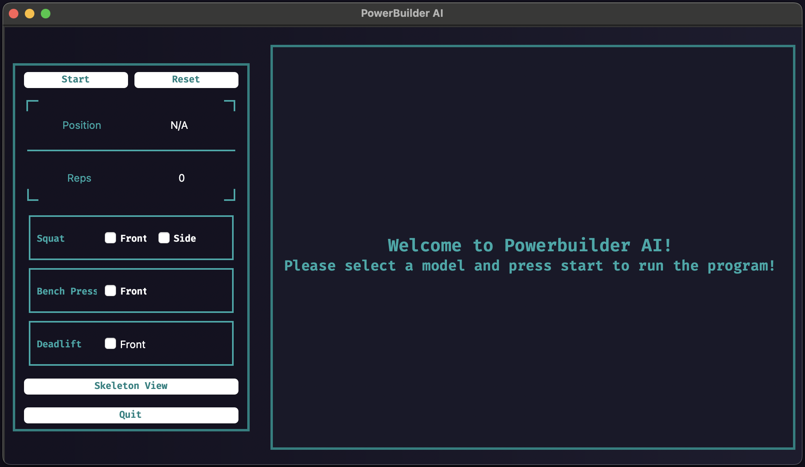
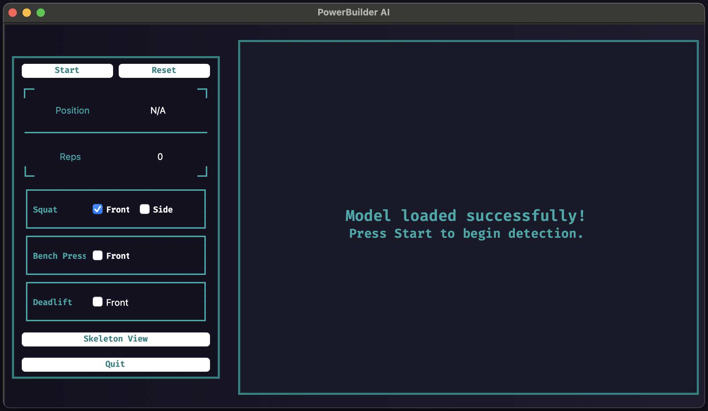

# PowerBuilderAI | Exercise Form Checker
Ever wish you had a tool which accurately tracked your movements and counted your reps for the Big 3 Lifts (squat, bench, and deadlift)? PowerBuilder AI does just that using computer vision and machine learning.

## Features
* **Real-time video capture, processing and pose detection using Mediapipe**
* **Support for offline pose detection for recorded videos**
* **Exercise-specific machine learning models for squat, bench press, and deadlift**
* **Repetition counting and movement phase detection**
* **Switch to Skeleton View to emphasize joint movement analysis**
* **CLI Support**

#### Technical Specification
* Data Collection: The training data was generated by recording videos of myself performing the movements, with key positions manually labeled using OpenCV and Mediapipe.
* Model Training: A Gradient Boosting Classifier was used for pose processing, achieving precision scores exceeding 90%, which ensures the models provide reliable predictions.
    - The classifier's hyperparameters, including learning rate, number of estimators, and maximum depth of trees, were tuned using GridSearchCV. This resulted in precision scores for all models ranging from 91% to 93%.

## Installation
* Install all the dependencies by running the following command:

```bash
pip install -r requirements.txt
```

## Demos

|       **Welcome Screen**        |         **Model Loaded Screen**         |
|:-------------------------------:|:---------------------------------------:|
|  |  |
| **Squat Front View Demo**       | **Deadlift Front View Demo**            |
|  |  |

|**Skeleton View Demo**|
|:-------------------------------:|
|  |


#### Future ToDos:
* Implement side view models for the bench press and the deadlift.
* Integrate real-time feedback based on movement analysis.
* Add support for lifts other than the Big 3.
* Add key joints and bar path tracking for the Big 3.

#### References
I used Jeff Nippard's videos on YouTube to develop the demos above:
* **[Squat Video](https://youtu.be/bEv6CCg2BC8)**
* **[Deadlift Video](https://youtu.be/VL5Ab0T07e4)**